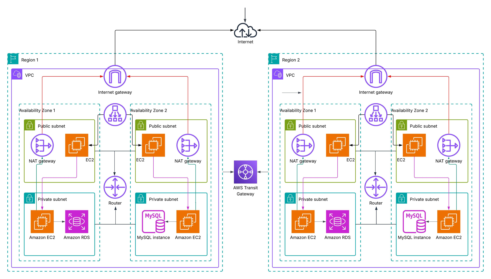

# Real Estate Platform – Network Diagram

---

## 1. Assumptions

EC2: Auto-scaled t3.medium to m5.large (or ECS Fargate equivalent)

RDS: Aurora MySQL with 2-4 replicas, multi-AZ

OpenSearch: ~3-6 data nodes for medium to large search volume

ElastiCache: Redis used for caching dynamic listing data

Data Transfer: Mix of intra-region, cross-region, and public access

Prices based on on-demand usage in US East (N. Virginia)

##  Summary

### 1. Project Details
The project is a cloud-based Real Estate Finder Platform designed to help users search for, bid on, and communicate about real estate listings across multiple regions and cities. It integrates with various third-party data providers and includes real-time chat and bidding systems. The architecture supports high availability, global scalability, and secure access for developers and services, with deployment across two AWS Regions, each having two Availability Zones (AZs) to ensure fault tolerance.

### 2. Architecture Decisions
To meet global demand, the system is deployed in Region 1 and Region 2, connected via an AWS Transit Gateway for seamless inter-region communication. Each region contains a Virtual Private Cloud (VPC) with public and private subnets distributed across two AZs. The public subnets host NAT Gateways and bastion or VPN access, while the private subnets securely run application workloads (EC2 or containers), Amazon RDS (MySQL) for relational data, and optionally OpenSearch and ElastiCache for search and performance optimization.

A Load Balancer in each region distributes traffic across app servers. Developers connect securely using a VPN Gateway or Client VPN Endpoint, accessing resources through isolated “Dev” subnets.

### 3. Reasoning
This multi-region architecture ensures resilience, disaster recovery, and low latency for users around the world. By distributing services across AZs, the platform withstands localized failures. The use of NAT Gateways allows outbound internet access from private subnets, while keeping internal services secure. Leveraging RDS with Multi-AZ improves data availability, while OpenSearch provides fast property searches. ElastiCache improves chat and bidding performance by caching frequent queries.

Using a VPN Gateway provides secure, centralized developer access without exposing private resources publicly, a key decision for DevOps readiness.

### 4. Networking Components Used and Their Use Case
| Component                | Use Case                                                         |
| ------------------------ | ---------------------------------------------------------------- |
| **VPC**                  | Isolated network per region                                      |
| **Public Subnets**       | Host NAT Gateways and Load Balancers                             |
| **Private Subnets**      | Host app servers, DBs, and background jobs securely              |
| **NAT Gateway**          | Allow private instances to access internet without exposing them |
| **Internet Gateway**     | Entry/exit for public resources like Load Balancers              |
| **Load Balancer**        | Distribute traffic to app servers                                |
| **AWS Transit Gateway**  | Connect VPCs across regions for global communication             |
| **RDS (MySQL)**          | Store structured listing, bidding, and user data                 |
| **OpenSearch**           | Index and search property listings efficiently                   |
| **ElastiCache**          | Cache bidding/chat data for real-time performance                |
| **Client VPN / OpenVPN** | Secure developer access to internal resources                    |

### 5. Estimated Monthly Costs

| Users (Concurrent / Monthly)  | EC2/ECS (App) | RDS (Aurora) | OpenSearch | ElastiCache | Data Transfer | **Total/Month** |
| ----------------------------- | ------------- | ------------ | ---------- | ----------- | ------------- | --------------- |
| 100 concurrent / 100K monthly | \$100         | \$120        | \$70       | \$40        | \$50          | **\$380**       |
| 10K concurrent / 1M monthly   | \$1,200       | \$800        | \$500      | \$300       | \$200         | **\$3,000**     |
| 100K concurrent / 10M monthly | \$6,000       | \$4,000      | \$2,500    | \$1,800     | \$1,000       | **\$15,300**    |
| 1M concurrent / 100M monthly  | \$50,000      | \$25,000     | \$15,000   | \$10,000    | \$8,000       | **\$108,000**   |

